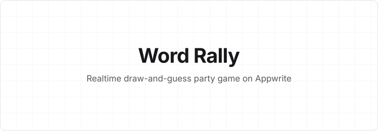
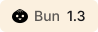
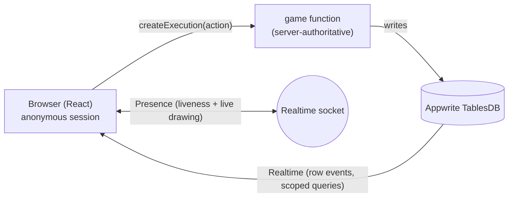

<!-- Header banner (adaptive light/dark) -->
<p align="center">
  <picture>
    <source media="(prefers-color-scheme: dark)" srcset="./assets/badges/header-dark.svg" />
    
  </picture>
</p>

<!-- Tech + repo badges (assets vendored in ./assets/badges) -->
<p align="center">
  <a href="https://react.dev"></a>
  <a href="https://www.typescriptlang.org"></a>
  <a href="https://bun.sh"></a>
  <a href="https://appwrite.io"></a>
  
  
</p>

<p align="center">
  <b>Pick a word · draw it · guess it · rotate.</b>
</p>

---

## Table of contents

- [What is Word Rally](#what-is-word-rally)
- [Features](#features)
- [How to play](#how-to-play)
- [Architecture](#architecture)
- [Tech stack](#tech-stack)
- [Getting started](#getting-started)
- [Testing](#testing)
- [Project structure](#project-structure)
- [Documentation](#documentation)
- [Roadmap](#roadmap)

---

## What is Word Rally

Each turn one player **picks** a word, the next **draws** it, and the next **guesses** it —
then every seat rotates one place, so nobody repeats a role until everyone has had it.
Highest score after the last round wins.

The client holds **no authoritative state**: it renders from live Appwrite data and drives
every transition through a single server function. Screens are dictated by `room.status`
and pushed to all players over Realtime.

---

## Features

- 🎮 **Realtime multiplayer** — rooms, roster, scoreboard, and guess feed update live over
  Appwrite **Realtime** (with server-side realtime queries scoped to the room).
- 🖊️ **Live drawing over Presence** — the drawer's strokes stream through the **Presences
  API**, no canvas table, auto-expiring on disconnect.
- 🔒 **Server-authoritative** — word picking, guess validation, scoring, and the turn timer
  all run in one Appwrite Function. The secret word is readable **only by the drawer**, so
  guesses can't be cheated.
- 🔁 **Round-robin roles** — 2–16 players; with 2 the roles gracefully collapse (picker also
  draws).
- 💡 **Paid letter-reveal** — the guesser can reveal letters for a hint, forfeiting the
  word's per-letter share of points (`points ÷ letters`).
- 🔊 **8-bit sound effects + mute** — synthesized via Web Audio (no asset files), with a
  persisted mute toggle.
- 🔗 **Shareable invite links** — the address bar stays `?room=CODE`; a shared link prefills
  and auto-joins.
- 🏆 **Match archive** — on game over a persistent results summary (leaderboard, words
  played, guess stats) is saved and the bulky transient data is purged.
- 🚪 **Leave / host End Match** — a persistent leave control and a host-only end-match action.
- 🕹️ **Retro arcade design system** — chunky bevels, pixel type, dot-grid, and a hand-built
  mascot — all tokenized in [`src/theme.ts`](src/theme.ts).

---

## How to play

1. **Host** creates a room and shares the 4-letter code (or the invite link).
2. Players **join**; the host starts once there are **2+ players**.
3. **Pick** — the picker chooses one of three suggested words (Easy / Medium / Hard) or types
   a custom one. Harder/longer words score more.
4. **Draw & guess** — the drawer draws on the canvas; the guesser types guesses. An exact
   match locks the turn; a near miss ("so close") nudges only the guesser. Need help? Reveal
   a letter — but it costs points.
5. **Score** — points are awarded (guesser, drawer, and picker all earn), then roles rotate.
6. **Winner** — after the last round the champion, podium, and words-this-match recap show.
   Host can **Rematch**.

---

## Architecture



- **One `game` Appwrite Function** is the sole writer of room status, roles, scores, and the
  server-stamped timer. Caller identity comes from the platform header
  `x-appwrite-user-id`, never the request body.
- **Realtime** drives screen transitions and the guess feed; **Presence** carries player
  liveness and the live drawing on the same socket.
- On game over, the function writes a `results` summary and purges `messages` + `secretWords`.

> Full request/data flow, security model, and the presence/drawing details are in
> **[`implementation.md`](implementation.md)**.

---

## Tech stack

| Layer | Choice |
|-------|--------|
| Runtime / bundler | **Bun 1.3** (HTML dev server + bundler) |
| UI | **React 19 + TypeScript** |
| Backend | **Appwrite Cloud** — TablesDB, Functions (node-appwrite), Realtime, Presences |
| Auth | Anonymous guest sessions |
| Styling | Inline design tokens ([`src/theme.ts`](src/theme.ts)) — see [`design.md`](design.md) |

---

## Getting started

### Prerequisites

- [Bun](https://bun.sh) ≥ 1.3
- An **Appwrite** project (Cloud or self-hosted ≥ 1.9 — needs Presences + TablesDB)
- The [Appwrite CLI](https://appwrite.io/docs/tooling/command-line): `npm i -g appwrite-cli`

### 1. Install

```bash
bun install
```

### 2. Point the client at your project

Edit [`src/config.ts`](src/config.ts) — set `endpoint` and `projectId` (or set them at
runtime via `localStorage`: `wr_endpoint` / `wr_project`).

### 3. Deploy the backend

```bash
appwrite login
appwrite push settings                                   # enables anonymous auth
appwrite push tables   --all                             # creates tables, indexes, permissions
appwrite push functions --all --force                    # deploys the game function
```

### 4. Run

```bash
bun dev        # http://localhost:3000  (HMR)
```

Open a second window (or the `?room=CODE` invite link) to play against yourself.

---

## Testing

```bash
bun test functions/game/src/logic.test.js   # pure game logic (scoring, near-match, roles, hints)
bunx tsc --noEmit                            # typecheck
bun build ./index.html --outdir dist         # production bundle
```

**Live end-to-end** — `scripts/e2e.ts` drives a full match with multiple anonymous guests
through the deployed function (sessions minted via a short-lived ephemeral key) and asserts
every server-authority guarantee — including secret-word visibility, guess rejection, the
paid reveal, archiving, and host controls.

```bash
KEY=$(appwrite project create-ephemeral-key --scopes sessions.write --duration 3600 \
  --json --show-secrets --force | bun -e 'process.stdin.text().then(t=>console.log(JSON.parse(t).secret))')
WR_KEY="$KEY" bun run scripts/e2e.ts
```

---

## Project structure

```
index.html              Bun HTML entrypoint (bundles src/index.tsx)
src/
  theme.ts              design tokens (see design.md)
  data.ts               phases, swatches, word-choice builder, palette
  words.json            curated word bank (~180 drawable words)
  config.ts             Appwrite endpoint/project/table ids + Channel builders
  lib/                  appwrite client, session, RPC, useRoom, presence, sound, types
  components/           Panel, Button, Toast, Chrome, Mascot, Icons
  screens/              Landing, Lobby, Pick, Play, Score, Winner
functions/game/         the server-authoritative Appwrite Function (+ logic tests)
scripts/e2e.ts          live end-to-end driver
appwrite.config.json    tables, indexes, permissions, function + settings
assets/badges/          vendored README badge + header SVGs
```

---

## Documentation

| Doc | What's inside |
|-----|---------------|
| [`implementation.md`](implementation.md) | Exact end-to-end flow: auth, the single-function RPC, realtime + presence, secret-word security, timer authority, data model, archive |
| [`design.md`](design.md) | Design system & standards: palette, bevels, typography, components, layout, guidelines |

---

## Roadmap

- **Voice chat** (WebRTC mesh signaled over Appwrite Realtime/Presence)
- **Deploy on Appwrite Sites** (static hosting)
- Typing indicators, awards, reconnection/late-join canvas replay, spectator polish
- An SFU path (LiveKit) for larger rooms

---

<p align="center"><sub>Word Rally — a concept prototype. Built with Bun, React, and Appwrite.</sub></p>
