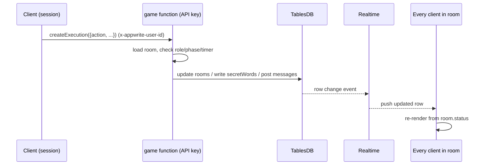
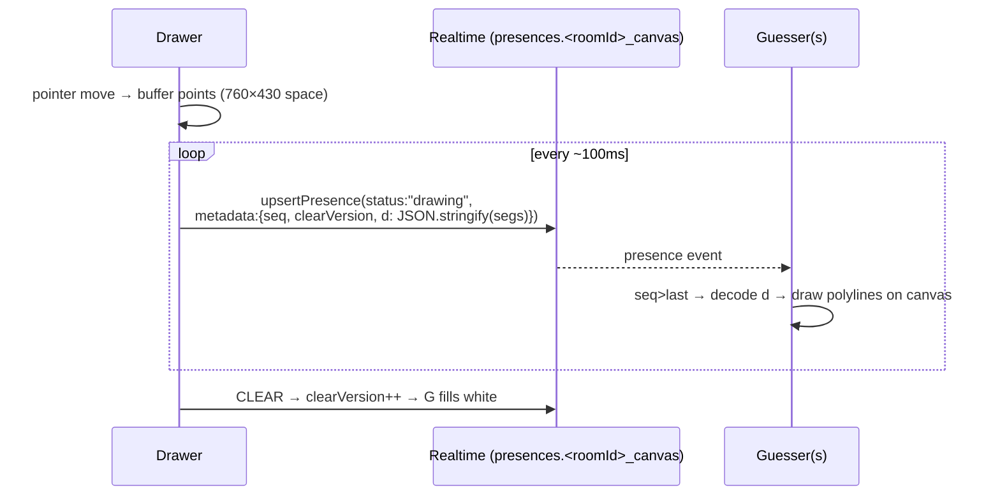

# Word Rally — Implementation & Data Flow

The exact flow the app follows. Client holds **no authoritative state**: it renders from
live Appwrite data and triggers every transition by calling one server function. Screens
are driven by `room.status`, pushed to all clients over Realtime.

Stack: Bun + React 19 + TS (client) · Appwrite Cloud (TablesDB + Functions + Realtime +
Presences). Backend verified live by `scripts/e2e.ts` (44/44).

---

## 1. Roles & the three clients

Two Appwrite `Client`s, because a request may carry a session **or** a JWT, never both:

| Client | Auth | Used for |
|--------|------|----------|
| `client` (`lib/appwrite.ts`) | anonymous **session** cookie | HTTP: `Account`, `TablesDB`, `Functions`, presence seed |
| `rtClient` | **JWT** (minted from the session) | the shared `Realtime` socket (subscribe + presence) |

**Why the split:** the realtime connection must be JWT-authorized to *send* presence over
the socket; a client carrying both a cookie and a JWT is rejected
(`JWT and cookie used in the same request`). So realtime gets its own JWT-only client.

### Session bootstrap (`lib/session.ts`, called once in `App`)

```
ensureSession():
  account.get()  ── fail → account.createAnonymousSession()   // guest identity
  jwt = account.createJWT()  →  rtClient.setJWT(jwt)           // authorize the socket
  setInterval(refresh jwt, 14 min)                            // JWTs live ~15 min
  return uid
```

Only after this resolves does `App` set `me`, so the JWT is in place before any
subscription opens.

---

## 2. Server-authoritative actions — one function, one RPC

Every state change is `functions.createExecution("game", { action, ... })`
(`lib/game.ts` → `call()`). The function (`functions/game/src/main.js`, node-appwrite +
dynamic API key) is the **only** writer of authoritative fields. It trusts the caller from
the platform header `x-appwrite-user-id` (never the request body).



Actions & guards:

| action | guard | writes |
|--------|-------|--------|
| `createRoom` | any user | rooms(lobby) + host players row; returns `{roomId, code}` |
| `joinRoom` | lobby, `< max` | players row + append to `turnOrder`/`scores` |
| `startMatch` | host, ≥2 players | status→pick, assign roles for turn 0 |
| `pickWord` | caller==picker | write **secretWords** (drawer-readable), masked/tier/points, `turnEndsAt`, status→play |
| `submitGuess` | caller==guesser, live | classify exact/near/wrong; on exact award + reveal + status→score |
| `endTurn` | drawer **or** expired | reveal, status→score |
| `nextTurn` | member, from score | rotate one seat; round++/winner; status→pick |
| `rematch` | host, from winner | zero scores, status→lobby |

**2-player rule:** with 2 players roles collapse — the picker also draws, the other
guesses, alternating each turn (`rolesForTurn` in `logic.js`). So the Pick screen decides
"am I the picker" by `me === room.pickerId`, not the derived role (which would be
`drawer`).

---

## 3. Live state — Realtime subscriptions (`lib/useRoom.ts`)

One socket (`new Realtime(rtClient)`), three channels via `Channel` builders:

```
realtime.subscribe(Channel.tablesdb(db).table("rooms").row(roomId), onRoom)     // single row
realtime.subscribe(                                                             // two tables,
  [ tables.players.row(), tables.messages.row() ], onTable,
  [ Query.equal("roomId", roomId) ]                    // ← REALTIME QUERY: server-side filter
)
```

- **rooms row** → drives all screen transitions, timer, masked/reveal word, scores, roles.
- **players / messages** → roster + guess feed, filtered to this room *server-side* by the
  realtime query, so other rooms' events never reach the client.
- Each subscription is seeded once over HTTP (`listRows`) for the initial snapshot, then
  kept live by the socket.

---

## 4. Presence — over the same socket (`lib/presence.ts`)

Presence is **sent over the JWT-authorized realtime connection** via
`realtime.upsertPresence({ presenceId, status, metadata, permissions })`. No `expiresAt`,
no heartbeat — it auto-expires when the tab disconnects. Received via
`realtime.subscribe(Channel.presence(id) | Channel.presences(), cb)`.

### Liveness (`usePresence`)
- Each player upserts `{ status:"online", metadata:{roomId, role, nickname} }`.
- Everyone subscribes to `presences`; the roster shows a green dot per online user.
- Seeded once via HTTP `presences.list()` so a late joiner sees players who announced
  before it connected. On leave, upsert `status:"away"`.

### Live drawing (`makeCanvasBroadcaster` / `subscribeCanvas`)
The drawer's strokes ride presence — **no canvas table**:



- One room-scoped presence id: `` `${roomId}_canvas` ``.
- Strokes are JSON-**stringified** into `metadata.d` so nested point arrays round-trip
  intact (verified by `scripts/presence-check.ts`).
- Ephemeral by design: a guesser who joins/refreshes mid-turn sees blank until the next
  stroke.

---

## 5. Secret-word security

The word must reach the **drawer** but never the **guesser**:

- `pickWord` writes the plaintext to a `secretWords` row with
  `permissions: [read(user:drawerId)]` — nobody else (not even other players) can read it.
- The drawer's client reads it (`PlayScreen` → `listRows secretWords`) to display + draw.
- The guesser submits guesses through `submitGuess`; the function compares against the
  secret server-side and returns only exact/near/wrong. The guesser's session literally
  cannot read the row.

Verified live: drawer reads it, guesser gets an empty list, a non-guesser's `submitGuess`
is rejected.

---

## 6. Timer authority

`turnEndsAt` is stamped by the server in `pickWord`. The client countdown is display-only;
`submitGuess`/`endTurn` re-check `now >= turnEndsAt` on the server, so a skewed client clock
can't extend or forge a turn. When the drawer's local countdown hits 0 it calls `endTurn`,
which the server re-validates.

---

## 7. Data model (`wordrally` database)

| Table | Writes | Reads | Notes |
|-------|--------|-------|-------|
| `rooms` | function | users | `status`, roles, `scoresJson`, `turnOrderJson`, `turnEndsAt`, masked/reveal word |
| `players` | owner | users | nickname/color/ready only — **no score** |
| `secretWords` | function | **drawer only** | plaintext word |
| `messages` | function (verdicts) + owner (chat) | users | guess feed |

Drawing is **not** a table — it lives entirely in presence metadata.

---

## 8. One full turn, end to end

1. `nextTurn`/`startMatch` sets roles, status→**pick** → all clients render Pick.
2. Picker `pickWord(word)` → secret stored (drawer-readable), timer set, status→**play**.
3. Drawer reads the secret, draws; each batch → `upsertPresence` → guessers render live.
4. Guesser types a guess → `submitGuess`; wrong/near post messages, exact awards points,
   sets reveal, status→**score**.
5. Any member `nextTurn` → rotate; after the last turn status→**winner**.
6. Host `rematch` → scores zeroed, status→**lobby**.
